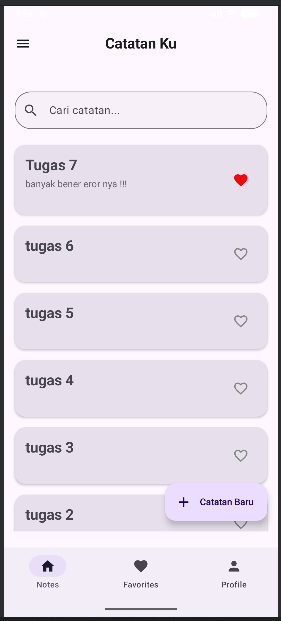
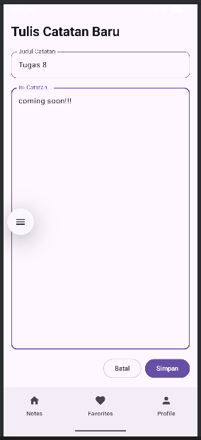
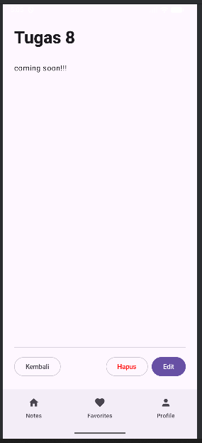
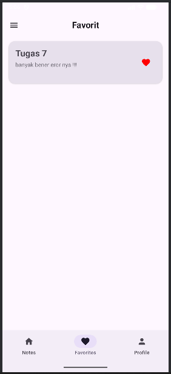
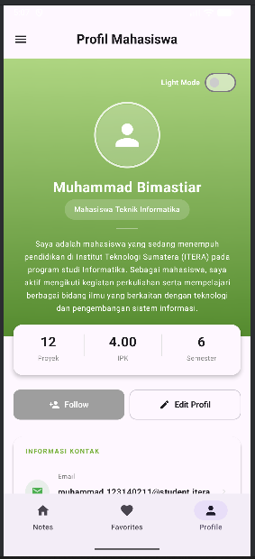
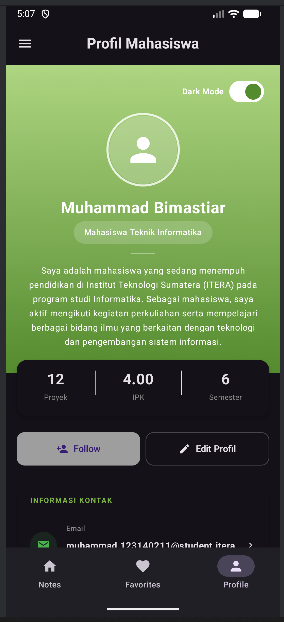

# Tugas Praktikum Minggu 7 - Database Offline-first (SQLDelight) & DataStore

* **Nama : Muhammad Bimastiar**
* **NIM : 123140211**

## Deskripsi Tugas
Mengembangkan proyek aplikasi dari minggu sebelumnya dengan melakukan *upgrade* arsitektur menjadi **Offline-first**. Aplikasi tidak lagi menggunakan *dummy state* yang hilang saat ditutup, melainkan menggunakan **SQLDelight** untuk penyimpanan database lokal dan **DataStore (Multiplatform Settings)** untuk preferensi pengguna. Berikut adalah fitur dan ketentuan yang diimplementasikan pada praktikum ini:

1. **Implementasi Database Lokal (SQLDelight):**
    - Mengganti `StateFlow` dummy dengan database SQLite (melalui SQLDelight) untuk melakukan operasi CRUD (Create, Read, Update, Delete) secara permanen.
    - Data catatan tidak akan hilang meskipun aplikasi ditutup secara paksa (*force close*).
2. **Fitur Pencarian Cerdas (Search):**
    - Menambahkan kolom pencarian (*search bar*) pada layar daftar catatan.
    - Pencarian berjalan secara *real-time* memfilter data dari database berdasarkan judul atau isi catatan.
3. **Penyimpanan Profil & Tema Persisten (DataStore):**
    - Status **Dark Mode**, Nama, dan Bio pengguna pada tab Profile kini disimpan menggunakan Multiplatform Settings (menggantikan DataStore/SharedPreferences murni).
    - Tema gelap/terang akan otomatis menyesuaikan dengan pilihan terakhir pengguna saat aplikasi dibuka kembali.
4. **Pemisahan Arsitektur (Repository Pattern):**
    - Menerapkan *best-practice* pengembangan Android dengan memisahkan logika akses data (Database/Settings) ke dalam layer `Repository` dan `SettingsManager`, sehingga `ViewModel` menjadi lebih bersih.
5. **Pemulihan Fitur Favorit (Love):**
    - Menyambungkan kembali fitur tombol "Love" untuk menyimpan status favorit secara permanen ke dalam kolom `is_favorite` di Database SQL, dan menampilkannya di tab Favorites.

## Struktur Folder
Proyek ini mengadopsi pemisahan *layer* yang terstruktur (UI, ViewModels, Repository, Database). Berikut adalah susunan *package* utamanya:

```text
composeApp/src/commonMain/kotlin/org/example/project/
├── App.kt                 # Entry point, inisialisasi Database, NavHost & Scaffold
├── components/
│   └── BottomNav.kt       # Komponen UI untuk Bottom Navigation
├── data/
│   ├── NotesRepository.kt # Layer penghubung antara ViewModel dan Database
│   └── SettingsManager.kt # Class pengelola penyimpanan lokal untuk setingan profil
├── db/
│   └── Note.sq            # File query SQLDelight untuk generate tabel & fungsi SQLite
├── navigation/
│   └── Routes.kt          # Definisi rute layar dan argument navigasi
├── ui/
│   ├── NotesScreens.kt    # Kumpulan layar Notes (List, Detail, Add, Edit, Favorites)
│   └── ProfileScreen.kt   # Layar profil pengguna
└── viewmodel/
    ├── NotesViewModel.kt  # Logika state, menghubungkan UI dengan NotesRepository
    └── ProfileViewModel.kt# Mengelola data profil yang di-load dari SettingsManager
```

## Cara Menjalankan Aplikasi (Langkah-langkah)

Proyek ini menggunakan basis **Jetpack Compose Multiplatform**. Berikut panduannya:

1.  **Persiapan IDE:** Gunakan **Android Studio** versi terbaru. Disarankan untuk menginstal plugin **SQLDelight** agar kode di file `Note.sq` terbaca dengan baik.
2.  **Buka & Build Proyek:** Buka folder proyek dan tunggu proses sinkronisasi Gradle. **Sangat penting:** Lakukan *Build -> Make Project* (atau klik tombol palu) setidaknya satu kali agar SQLDelight men-*generate* file Kotlin dari `Note.sq`.
3.  **Jalankan Aplikasi:** - Untuk **Android**: Tekan `Shift + F10` atau klik tombol hijau **Run** ke emulator/perangkat fisik.
4.  **Uji Coba Fitur:** - Tambahkan catatan baru, lalu matikan/tutup aplikasi dari *Recent Apps*, dan buka kembali. Catatan akan tetap ada (Persistent).
    - Coba ketikkan sesuatu di kolom *Search* pada layar beranda untuk mencari catatan spesifik.
    - Ubah mode ke *Dark Mode* di tab Profil, tutup aplikasi, dan buka kembali. Tema gelap akan tetap tersimpan.
    - Klik ikon hati pada catatan untuk memasukkannya ke tab Favorites.

## Hasil

### 1. Tampilan Notes & Fitur Pencarian (Search)
*(Tampilan daftar catatan dari Database SQLDelight dan kolom pencarian real-time)*




### 2. Tampilan Tambah/Edit Catatan
*(Layar interaktif dengan form input untuk menyimpan/mengupdate data permanen ke Database)*




### 3. Tampilan Favorit & Detail Catatan
*(Catatan yang difavoritkan tersimpan permanen dan dapat dilihat secara detail)*



### 4. Tampilan Profile & Dark Mode (Persistent)
*(Pengaturan profil dan tema yang tidak akan reset saat aplikasi direstart)*




### 5. Video Demo
*(Tautan/File Video Demo)*

**Tonton Video Demo:** 